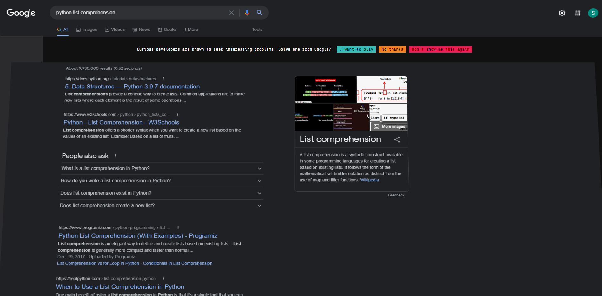
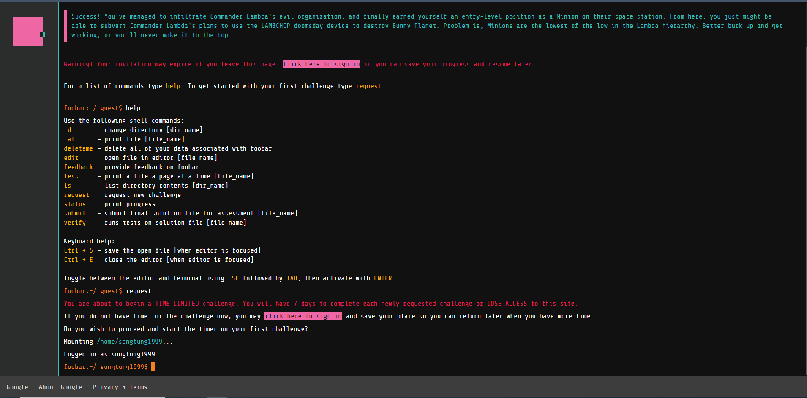

# Google Foobar Challenge
I was lucky enough to get invited to join the challenge. The invite appears after I searched for the term **python list comprehension**
on Google.

|  | 
|:--:| 
| **The invitation** |

|  | 
|:--:| 
| **After accepting the invite** |

I have had a lot of fun solving the problems. This repo will contain all of my solutions for each of the problem I encountered.

At the moment, I have only managed to get through 3 levels, the repo will be update as I continue onwards.
